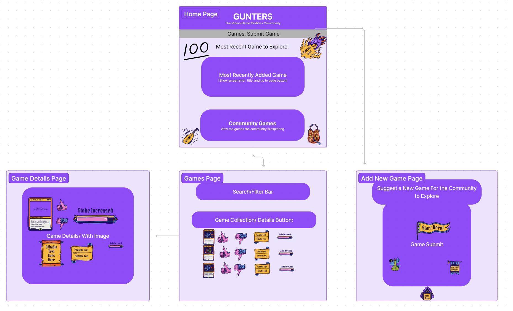
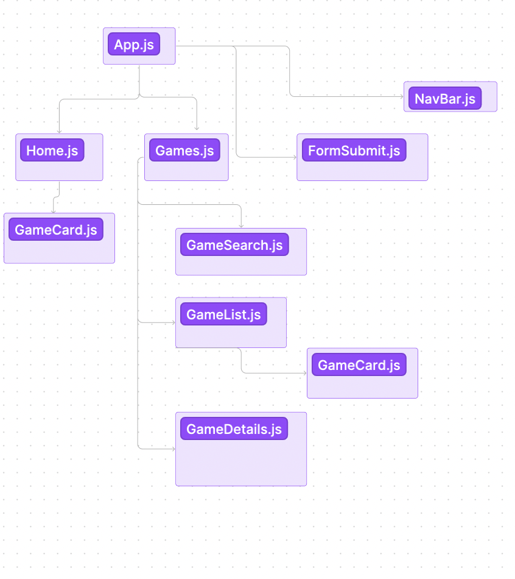

# Gunters
## An app to browse and discuss video game easter eggs

## Table of contents
* [Intro](#intro)
* [Setup](#setup)
* [User Features](#user-features)
* [Project Status](#project-status)
* [Current App Structure](#current-app-structure)

## Intro 
We created this app to provide a community forum for browsing video game titles and discussing video-game easter eggs. We built it using React.js (18.2.0), including react-router-dom (5.3.0), as we wanted to practice React and improve our client-routing skills while attending the Flatiron School's software engineering course. 

## Setup / Launch
    1) Use Heroku
    2) To run this project, install it locally using npm:

```
$ cd ../lorem
$ npm install
$ npm start
```

## User Features
1) User can browse and search/filter games in the persistent db.json backend
2) User can POST name-video game entry to the persistent db.json backend via form submission

## Project Status
Not done yet. Still working on PATCHing/editing game details and easter eggs

## Current App Structure
### Site Map / Client-side Routing


### React Component Tree

